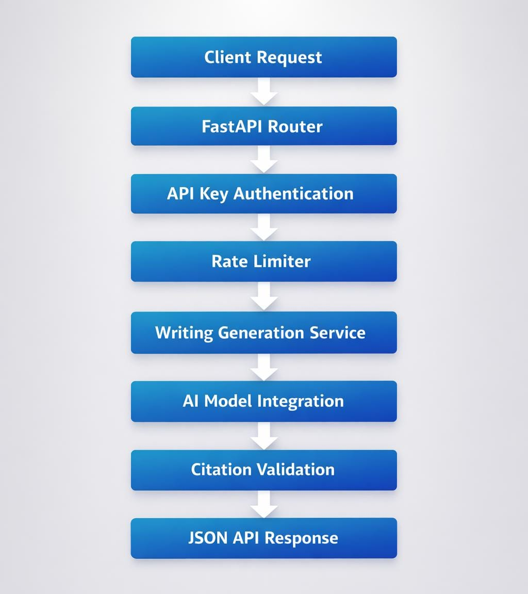
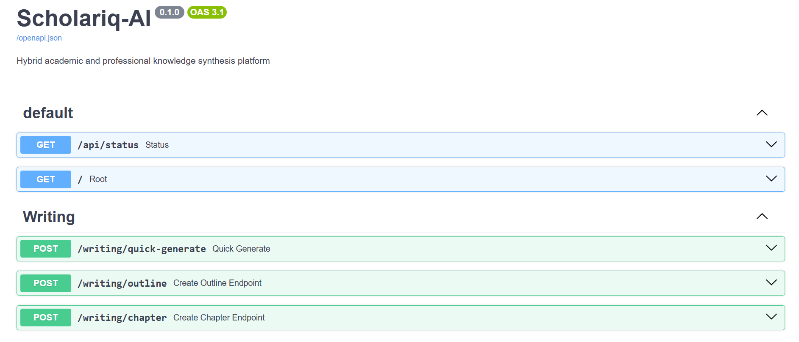
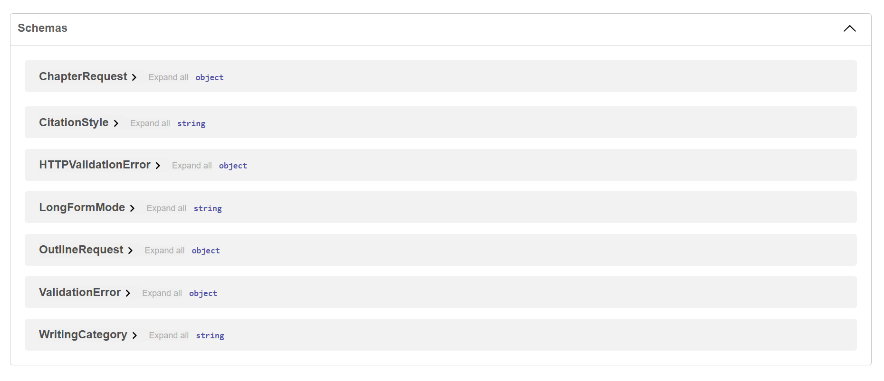

# Scholariq-AI
AI-powered backend API for generating structured academic writing while detecting citation hallucinations in AI-generated content.


AI backend API that generates structured academic and professional writing while detecting citation hallucinations.

Scholariq-AI combines AI text generation with citation validation to help identify unreliable references produced by large language models.

---

## Project Overview

Many AI writing tools generate fluent text but frequently produce unreliable citations or poorly structured academic writing.

Common issues include:
```
• Non-existent academic references
• Broken citation formatting
• Fake journals or publishers
• Repeated fabricated sources
• Disorganized research structure
```

These problems reduce trust in AI-generated academic content.
Scholariq-AI introduces a validation layer that analyzes citations and flags suspicious references before the content is used.
---

## Key Features
```
• AI-powered long-form writing generation
• Structured research outlines and chapter generation
• Citation hallucination detection
• Multiple academic citation styles supported
• API key authentication
• Request rate limiting for security
• Modular backend architecture
• Interactive API documentation
```
---

## Live API
```
https://scholariq-ai.onrender.com/
```

Interactive documentation:
```
https://scholariq-ai.onrender.com/docs
```
---
## Quick API Demo

Run the API locally and test a writing request in seconds.

Start the server:
```
uvicorn app.main:app --reload
```
Send a test request:
```
curl -X POST "http://localhost:8000/writing/quick-generate" \
-H "Content-Type: application/json" \
-H "Authorization: Bearer YOUR_API_KEY" \
-d '{"topic": "Impact of Artificial Intelligence on Healthcare"}'
```
---

## Technical Stack
```
Backend Framework
FastAPI

Language
Python 3.11

AI Model Integration
Google Gemini

Validation
Pydantic

Server
Uvicorn

Environment Management
python-dotenv

Containerization
Docker

Deployment Platform
Render
```
### Database Note
```
ScholarIQ is a stateless generation API. Each request is processed and a response returned — there is no user data, session state, or content history to persist.
SQLite is used exclusively for rate limiting state (via SlowAPI). This is a deliberate, scoped choice: rate limiting requires only lightweight in-process counters, not a networked database. SQLite is appropriate for this use case.
A PostgreSQL version with user account management, generation history, and API key dashboards is planned as the next architectural phase.
```

---

## Project Structure
```
scholariq-ai
│
├── app
│   ├── main.py
│   ├── api
│   ├── routes
│   ├── services
│   ├── models
│   ├── core
│   ├── tests
│   └── workers
│
├── Docs
│   ├── swagger-ui.png
│   ├── schemas.png
│   ├── system-architecture.png
│   └── api.md
│
├── ARCHITECTURE.md
├── CONTRIBUTING.md
├── LICENSE
├── README.md
├── Dockerfile
├── Procfile
├── requirements.txt
└── .env.example
```

## Folder Responsibilities
```
| Folder    | Purpose                                                  |
| --------- | -------------------------------------------------------- |
| routes/   | Defines API endpoints                                    |
| services/ | Contains AI generation and citation validation logic     |
| models/   | Defines request and response schemas                     |
| core/     | Handles configuration, authentication, and rate limiting |
| tests/    | Contains API and validation tests                        |

```
---

# System Architecture
```
Scholariq-AI follows a layered backend design.

Client Request
↓
FastAPI Router
↓
API Key Authentication
↓
Rate Limiter
↓
Writing Generation Service
↓
AI Model Integration
↓
Citation Validation
↓
JSON API Response
```
### Architecture Diagram



A detailed explanation of the system design is available in:

ARCHITECTURE.md

---

## Running the Project Locally
```
Clone the repository.

git clone https://github.com/CynthiaKaluson/scholariq-ai.git
cd scholariq-ai

Create a virtual environment.

python -m venv venv

Activate the environment.

Linux / Mac

source venv/bin/activate

Windows

venv\Scripts\activate

Install dependencies.

pip install -r requirements.txt

Start the API server.

uvicorn app.main:app --reload

The API will run at:

http://localhost:8000
```
---

## API Documentation
```
Interactive documentation is generated automatically by FastAPI.

Open:

http://localhost:8000/docs

API Explorer

"Swagger UI" ()

Request / Response Schemas

"Schemas" ()
```
---

## Developer-Friendly API
```
Scholariq-AI is designed as a developer-first backend service.

Features that make integration easy:

• JSON-first API responses
• Automatic OpenAPI documentation
• Interactive Swagger testing interface
• Clear request and response schemas
• Environment-based configuration

API documentation is available at:

/docs
```
---

## Environment Variables
```
Create a ".env" file in the project root.

Example:

GEMINI_API_KEY=your_api_key_here
GEMINI_MODEL=gemini-3-flash-preview

Important:

".env" should never be committed to GitHub.

Use ".env.example" to document required variables.
```
---

## Deployment

The API supports container-based deployment.

Example start command:

uvicorn app.main:app --host 0.0.0.0 --port $PORT
```
Deployment platforms supported:

• Render
• Railway
• Docker environments
```
---
# Future Improvements
```
• Database-backed citation verification
• User API key management dashboard
• Request analytics and logging
• Async background processing for long documents
• Academic citation database integration
```

---
## Why This Project Matters

Large language models are powerful writing tools, but reliability remains a challenge in academic environments.

Scholariq-AI explores a practical direction by combining AI writing generation with automated citation validation.

Instead of blindly trusting generated content, the system analyzes citations and highlights potential hallucinations before the output is used.

---

## Author
```
Cynthia Kalu Okorie

Backend developer focused on AI systems, backend engineering, and intelligent APIs.
```